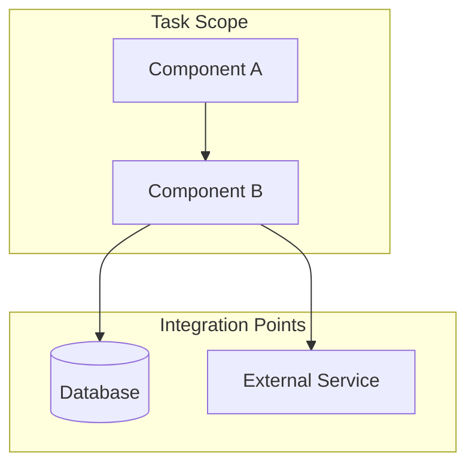

# Architectural Context

Create Mermaid diagram with components, integration points, and test boundaries. Create interim artifact `work/09-architecture.md`.

## Entry Criteria

- [ ] Step 08 (Pipeline Tests) completed with test requirements defined
- [ ] `work/08-pipeline-tests.md` exists
- [ ] Component changes identified

## Actions

### Document Key Relationships

The diagram should show:
- Components involved in this task
- Integration points (APIs, events, data stores)
- Test boundaries
- Downstream impacts

### Purpose

This diagram helps implementers:
- Understand integration points
- Identify test boundaries
- Verify implementations actually integrate (not just pass tests with mocks)
- See downstream impacts of changes

### Create Interim Artifact

Write findings to `work/09-architecture.md`:

```markdown
# Architectural Context

## Component Diagram



## Components Involved
- **[Component 1]**: [Role in this task]
- **[Component 2]**: [Role in this task]

## Integration Points
- **[Integration 1]**: [API/Event/Data store] - [How used]
- **[Integration 2]**: [API/Event/Data store] - [How used]

## Test Boundaries
- **Unit Tests**: [What's mocked vs real]
- **Integration Tests**: [What's tested together]
- **E2E Tests**: [Full flow coverage]

## Downstream Impacts
- [Impact 1]: [Description]
- [Impact 2]: [Description]
```

## 💬 If GOVERNED Mode

- **Stop**
- Display > ## 💬 Discussion Point
- Present the architectural context diagram:
  - "Here's the architectural context for this task:"
  - [Show Mermaid diagram]
  - "Does this capture the key integration points?"
- Wait for confirmation before continuing execution.

## 🤖 If DELEGATED Mode

- Apply the following heuristic
- Generate diagram using available architecture documentation as references
- Include all components mentioned in the task
- Show event flows and API integrations
- Create `work/09-architecture.md` with diagram
- Proceed to Step 10 after artifact created

## Exit Criteria

- [ ] Architectural context diagram created
- [ ] Key relationships documented (components, events, APIs)
- [ ] Integration points and test boundaries visible
- [ ] `work/09-architecture.md` created

## Next Step

→ [10-acceptance-criteria.md](./10-acceptance-criteria.md)

<!-- dft:verified:edd3fUAMxwemxQB+b0i22cUfqtDn4YbiB8zn/N53teo=:govern.proc.task-planning:0.2.0:2026-08-06T13:11:15Z -->
