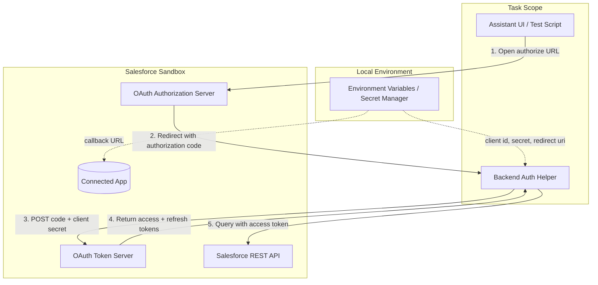

# Architectural Context: SDE-0001

## Component Diagram

## Components Involved

- **Assistant UI / Test Script**: Initiates the OAuth flow for local testing and displays the final smoke-test result.
- **Backend Auth Helper**: A Python module that builds the authorization URL, exchanges the code, refreshes tokens, and makes a test SOQL query.
- **Salesforce Connected App**: The OAuth client registered in the sandbox; defines scopes and callback URL.
- **Salesforce OAuth Servers**: Authorize and token endpoints (`test.salesforce.com` or `login.salesforce.com`).
- **Salesforce REST API**: Used for the smoke-test SOQL query to confirm access.
- **Local Secret Manager / Environment Variables**: Holds `SALESFORCE_CLIENT_ID`, `SALESFORCE_CLIENT_SECRET`, `SALESFORCE_REDIRECT_URI`, and `SALESFORCE_LOGIN_URL`.

## Integration Points

- **OAuth Authorize URL**: `GET https://test.salesforce.com/services/oauth2/authorize?...` — initiated by UI/test.
- **OAuth Token URL**: `POST https://test.salesforce.com/services/oauth2/token` — backend exchanges code.
- **Salesforce REST Query**: `GET /services/data/v62.0/query` — backend smoke test.
- **Environment configuration**: Backend reads credentials at startup; never committed.

## Test Boundaries

- **Unit Tests**: OAuth URL builder and token response parser can be unit-tested with mocked endpoints.
- **Integration Tests**: Real token exchange against a sandbox with a test user; requires `SALESFORCE_CLIENT_SECRET`.
- **E2E Tests**: Not required for this task; E2E flows begin in SDE-0002+.

## Downstream Impacts

- SDE-0002 and all data access tasks depend on a working OAuth token produced by this task.
- SDE-0003 (API gateway) will reuse the same client configuration and callback handling.
- The scope list chosen here affects which records the assistant can read for SDE-0006/0007.
